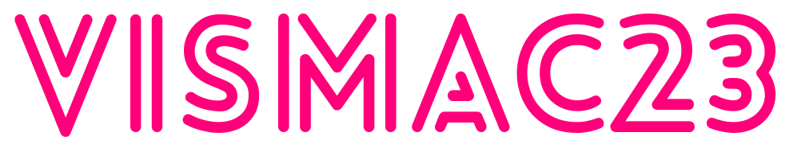

<div style="text-align:center">
  
  <p style="font-size: 22px">The international Summer School in <b>Machine Vision</b></p>
  <p>Padova, Italy - September 4-8, 2023</p>
</div>


## [Visit the website](https://lparolari.github.io/vismac23/)

## Introduction

This repository contains the code for the VISMAC23 website.

## About

The international summer school VISMAC “VISione delle MACchine” (in English, “Machine Vision”) is organized every two years by the Italian Computer Vision and Pattern Recognition (CVPL) society affiliated to the International Association for Pattern Recognition (IAPR).

The school aims to provide a stimulating opportunity for Ph.D. students and young researchers through lectures and tutorials led by computer vision experts. Participants will also have the opportunity to present the results of their research, and to interact with their scientific peers, in a friendly and constructive environment.

## Development

### Method 1

Simply open `index.html` in your browser.

### Method 2

Run

```bash
npx http-server
```

and open [http://localhost:8080](http://localhost:8080)

## Deploy

Deploy is automatic thanks to GitHub Pages.

## Credits

* [Vixcon theme](https://demo.themefisher.com/vixcon/)
